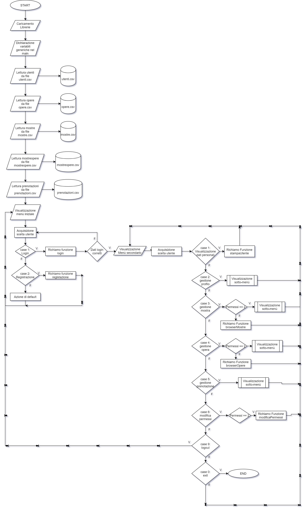
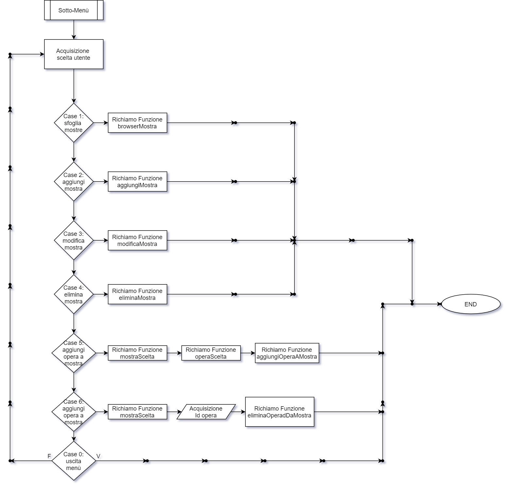

# ProjectStarkIndustries

Il programma simula un software gestionale per l’organizzazione e gestione di eventi da parte di una galleria d’arte per i propri clienti. 
Il sistema prevede l’utilizzo da parte di due figure principali: amministratore/dirigente e utente. Queste due figure hanno accesso a funzioni diverse, infatti, il dirigente potrà accedere a tutti i dettagli delle mostre, quali: inserimento, modifica ed eliminazione. Mentre l’utente, oltre a potersi registrare e gestire il proprio profilo (modificandolo e/o eliminandolo), potrà anche prenotare una o più visite alle mostre disponibili e di conseguenza gestire le proprie prenotazioni modificandole o disdicendole. 
Il software è scritto in linguaggio C il quale garantisce elevate prestazioni ed è prodotto utilizzando metodi che forniscono:
•	elevata portabilità, permettendo l’esecuzione del programma su vari sistemi operativi, come: Windows e sistemi operativi basati su UNIX (Linux e MacOS);
•	risparmio di memoria dato, da un forte utilizzo di funzioni atte a gestire dinamicamente la memoria;
•	documentazione e modularità, che permettono un elevato potenziale di manutenzione nel tempo;
Le informazioni, all’avvio del programma, vengono automaticamente lette da file memorizzati su memoria di massa e verranno aggiornati per ogni modifica dei dati. Nel caso in cui i file non dovessero essere presenti, il programma provvederà a crearli.
Tutte le funzioni di cui il programma dispone vengono mostrate attraverso dei menù di scelta. 
Il sistema permette all’utente di registrarsi inserendo i seguenti dati:
•	Nome
•	Cognome
•	Nickname (univoco)
•	Email (univoca)
•	Password 
•	Data di nascita
Inoltre, il sistema assegnerà automaticamente un identificatore numerico univoco, e al primo utente che si registra attribuisce i permessi di livello 2 (amministratore), mentre gli utenti che si registreranno successivamente avranno i permessi di livello 1 (utente base). Questi ultimi potranno essere modificati dagli amministratori.

Tutte le entità hanno un campo in più, chiamato "next", non visibile all'utente finale, in quanto viene usato esclusivamente dal programmatore per permettergli l'utilizzo delle liste concatenate.

Le funzioni disponibili sono molteplici e si differenziano in base al livello dei permessi che l’utente possiede. Come, ad esempio, la ricerca di un’opera e la rispettiva mostra in cui essa è esposta, oppure, ricerche su un livello più generale, come in riferimento al periodo storico o al genere, così come la gestione del proprio profilo personale. 
Queste funzioni appena citate sono accessibili da tutti gli utenti, indipendentemente dai permessi che questi ultimi possiedono. Invece alcune delle funzioni accessibili solo dagli utenti che posseggono i permessi di livello 2 (ovvero dagli amministratori) sono ad esempio, la gestione delle mostre e delle opere, infatti l’amministratore avrà accesso a tutti i dettagli, difatti potrà inserire nuove mostre/opere, modificarle o eliminarle, inoltre un’altra funzione molto importante che l’amministratore possiede, è quella di poter modificare il livello dei permessi degli altri utenti.

Inoltre, l’utente base, ovvero colui che possiede i permessi di livello 1, potrà comunque accedere alla visualizzazione delle mostre e delle opere, però senza poterne modificare il contenuto. Ha in aggiunta la possibilità di poter prenotare le visite alle mostre, e di conseguenza modificare/eliminare le proprie prenotazioni.
Per di più il sistema effettuerà dei controlli sulle date, difatti non sarà possibile cancellare le prenotazioni a meno di 48 ore dalla mostra.

FlowCharts
----------

flowchart del main:

flowchart del menu mostra:
